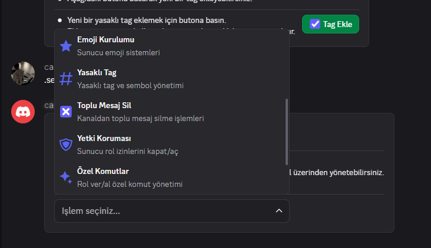
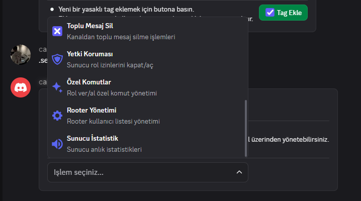

  <h2 align="center">Discord Bot Paketi — Satılık</h2>
  
JavaScript ile yazılmış, PM2 üzerinde çalışan çok botlu Discord sunucu yönetim sistemi.

---

## Hakkında

Uzun süre aktif olarak geliştirdiğim ve kendi sunucumda kullandığım bot paketini satışa çıkarıyorum. Discord'u bıraktığım için artık aktif geliştirme yapmıyorum. Sistem eksiksiz çalışır durumda teslim edilir.

Adıma açılan sahte hesaplara inanmayın. Tek iletişim kanalım aşağıda belirtilmiştir.

**İletişim:** Discord — `cartelfx`

---

## Özellikler

- **Tamamen Özelleştirilebilir** — Sunucunuza özel rol, kanal ve ayar yapılandırması
- **Web Yönetim Paneli** — Bot ayarlarını tarayıcı üzerinden yönetin
- **PM2 Destekli** — 5 ayrı bot process, otomatik yeniden başlatma
- **230+ Komut** — Moderasyon, istatistik, ekonomi, kayıt, görev ve daha fazlası
- **Discord Components V2** — Tüm arayüzler Container + Section tabanlı modern tasarım
- **MongoDB** — Tüm veriler kalıcı olarak saklanır
- **Kolay Kurulum** — 1 saat içinde tüm sistemler ayağa kalkar

---

## Botlar

| Bot | Görev |
|-----|-------|
| **Moderator** | Moderasyon, kayıt, ceza, yetkili yönetimi |
| **Countery** | Sunucu kurulumu, ayarlar, bot yönetimi |
| **Point** | İstatistik, sıralama, görev sistemi |
| **Invite** | Davet takibi |
| **Guardian** | Sunucu koruma, anti-raid |

---

## Kurulum Gereksinimleri

Gerekli yazılımları görmek için tıklayın

- [Visual C++ Redistributable](https://aka.ms/vs/17/release/vc_redist.x64.exe)
- [MongoDB 7.0](https://fastdl.mongodb.org/windows/mongodb-windows-x86_64-7.0.0-signed.msi)
- [MongoDB Database Tools](https://fastdl.mongodb.org/tools/db/mongodb-database-tools-windows-x86_64-100.9.0.msi)
- [Node.js v22](https://nodejs.org/dist/v22.17.0/node-v22.17.0-x64.msi)
- [FFmpeg](https://www.gyan.dev/ffmpeg/builds/ffmpeg-release-essentials.7z)

---

## Ekran Görüntüleri

### Sunucu Kurulum Paneli

---

### Bot Yönetimi

---

### Görev Sistemi

---

### Sorun Çözme Merkezi

---

### Ceza İtiraz Sistemi

---

### Loca Özel Oda Sistemi

---

### Yetki Senkronizasyon

---

### Tutarsızlık Tarama

---

### Şüpheli Hesap Kontrolü

---

### Yasaklı Tag Yönetimi

---

### Özel Komutlar

---

### Rooter Yönetimi

---

## İletişim

Satın alma ve sorularınız için Discord üzerinden ulaşabilirsiniz.

**Discord:** `cartelfx`
